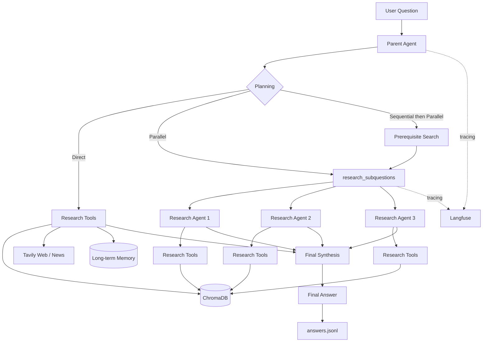
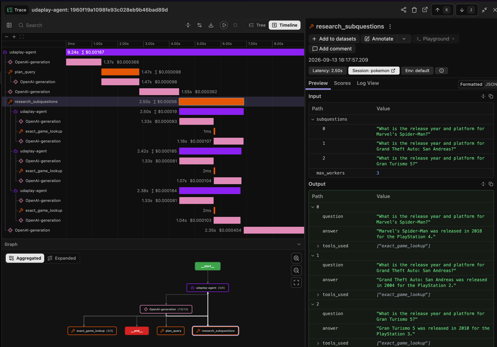
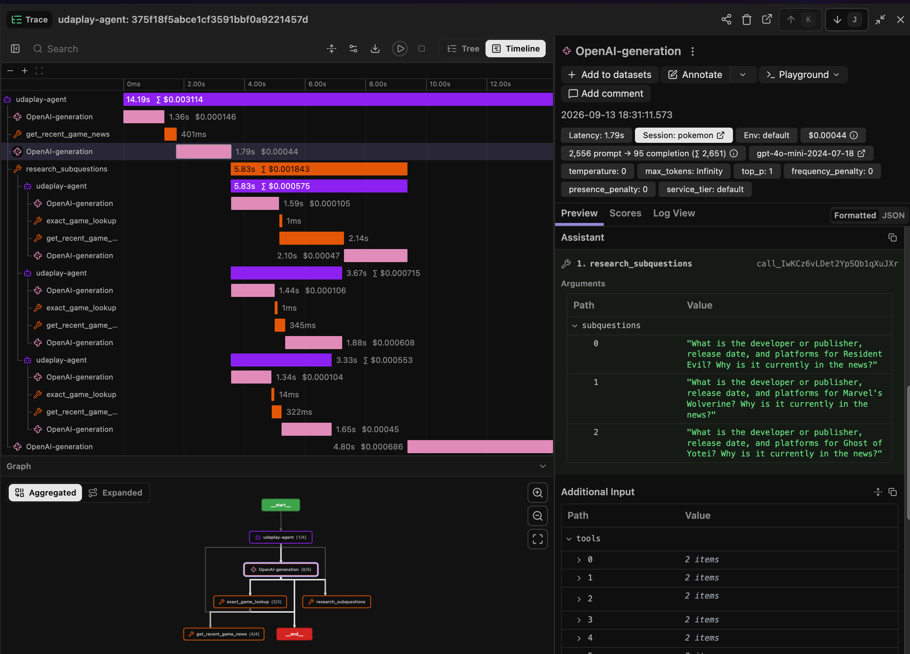

# UdaPlay Agentic RAG — Reflection

## Overview

I extended the original UdaPlay RAG project into a more capable game-research agent. The final system can use local game data first, evaluate retrieval quality, fall back to web or news search, remember useful web results, plan more complex questions, and run independent research tasks in parallel.

## Improvements

The main improvements I added were:

- **Exact game lookup** for structured metadata when semantic search is not precise enough.
- **Recent-news search** using Tavily for time-sensitive gaming questions.
- **Persistent long-term memory** in ChromaDB so useful web research can be reused later.
- **Query planning** with three strategies:
  - `direct`
  - `parallel`
  - `sequential_then_parallel`
- **Parallel research subagents** using `ThreadPoolExecutor`.
- **Structured JSONL output** containing the question, answer, tools used, tokens, and duration.[outputs/answers.jsonl](./outputs/answers.jsonl)
- **Langfuse observability** for inspecting LLM calls, tools, latency, nested agents, and parallel execution.
-  **Pytest**

The basic retrieval strategy is still local-first:

```text
Local retrieval
      ↓
Evaluate result
      ↓
Good enough? ── yes ──> Answer
      │
      no
      ↓
Web search
      ↓
Save useful result to memory
      ↓
Answer
```

## Architecture



## Observability with Langfuse

I added Langfuse because normal console logs were not enough to understand multi-step agent behavior.

Langfuse lets me inspect:

- LLM calls,
- tool selection,
- tool inputs and outputs,
- execution time,
- token usage,
- nested subagents,
- and parallel execution.

The tracing code is centralized in `lib/observability.py` using small decorators such as:

```python
@trace_agent(name="udaplay-agent")
```

This keeps observability separate from the agent logic.

### Langfuse Screenshots

Agent trace:

#### Langfuse parallel execution:         


Query: "Compare Marvel's Spider-Man, Grand Theft Auto: San Andreas, and Gran Turismo 5. For each game, find the release year and platform, then tell me which was released first and which was released most recently."

#### Sequential then parallel:     


Query: "Find three games that have had major news or announcements in the past month. For each game, research its developer or publisher, release date and platforms, and explain briefly why it is currently in the news. Then compare the three"

These traces were especially helpful when debugging whether multiple research tasks were actually running concurrently.

## Local Setup

Install dependencies:

```bash
uv sync
```

Create a `.env` file:

```env
OPENAI_API_KEY="..."
CHROMA_OPENAI_API_KEY="..."
TAVILY_API_KEY="..."

LANGFUSE_PUBLIC_KEY="..."
LANGFUSE_SECRET_KEY="..."
LANGFUSE_BASE_URL="https://us.cloud.langfuse.com"
```

Run the agent:

```bash
uv run python main.py
```

Run tests:

```bash
uv run pytest -v
```

The persistent ChromaDB data is stored locally under:

```text
chromadb/
```

Structured agent results are written to:

```text
outputs/answers.jsonl
```

## References

- Udacity UdaPlay project instructions
- OpenAI Function Calling documentation  
  https://platform.openai.com/docs/guides/function-calling
- Chroma documentation  
  https://docs.trychroma.com/
- Tavily documentation  
  https://docs.tavily.com/
- Langfuse documentation  
  https://langfuse.com/docs
- Python `concurrent.futures` documentation  
  https://docs.python.org/3/library/concurrent.futures.html
